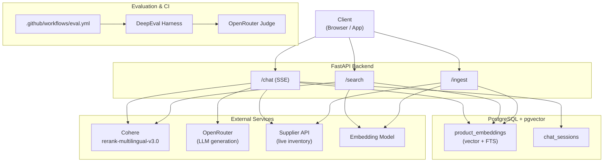
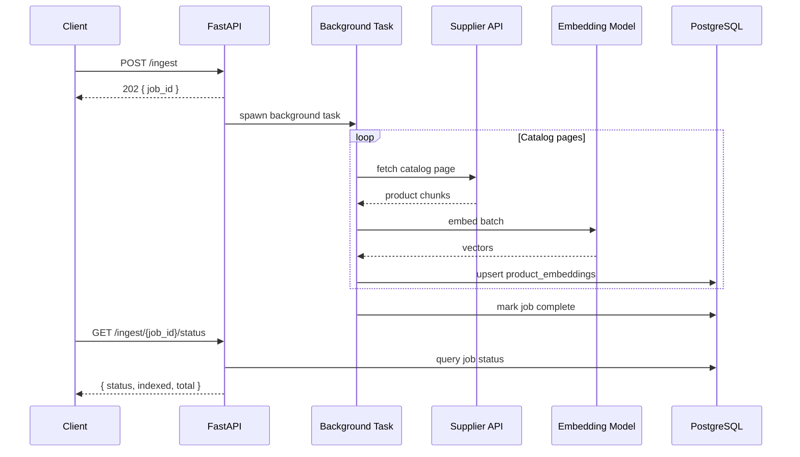
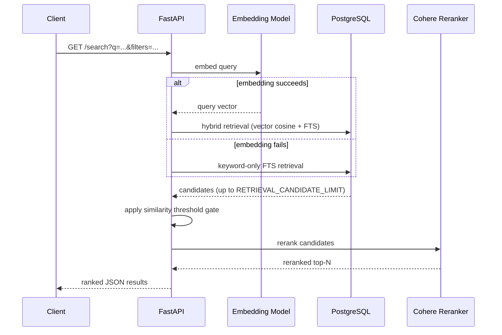
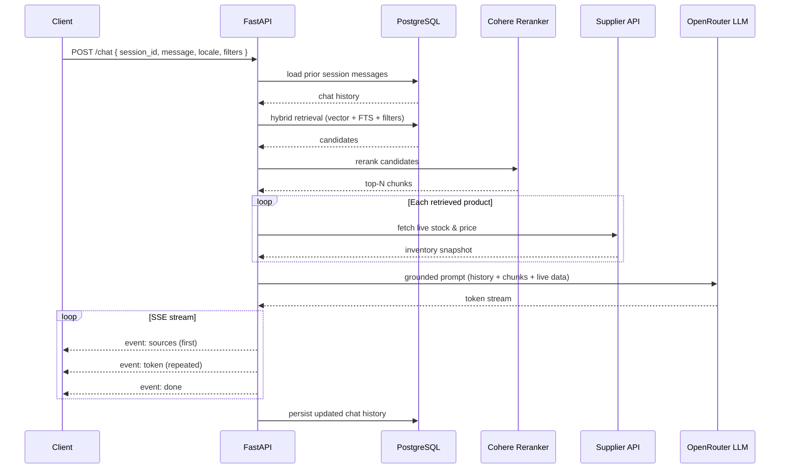

# nexus-chat-api (Python RAG Backend)

FastAPI backend for product-grounded search and chat over a supplier catalog.

## Architecture



## Workflows

### Ingest



### Search



### Chat



## What is Implemented

- Hybrid retrieval with vector + PostgreSQL FTS candidate generation
- Similarity threshold gating on retrieval scores
- Cohere reranking (`rerank-multilingual-v3.0`) for final ordering
- Live inventory enrichment after retrieval (fresh stock/price snapshot)
- Embedding failure fallback to keyword-only retrieval
- Async ingest jobs (`POST /ingest`) with job polling (`GET /ingest/{job_id}/status`)
- DB bootstrap for `TSVECTOR` maintenance trigger + GIN index + IVFFlat vector index
- DeepEval harness and nightly/PR workflow
- DSPy offline optimization with compiled instruction artifact load at startup

## Database Bootstrap

Startup runs automatic bootstrap (enabled by default):

- Creates `product_embeddings` and `chat_sessions` if missing
- Adds `content_tsv` column on `product_embeddings`
- Creates trigger `trg_product_embeddings_tsv` to maintain `content_tsv`
- Creates GIN index on `content_tsv`
- Creates IVFFlat index on vector column:

```sql
CREATE INDEX CONCURRENTLY IF NOT EXISTS idx_product_embeddings_vector
  ON product_embeddings USING ivfflat (embedding vector_cosine_ops)
  WITH (lists = 100);
```

Manual SQL bootstrap is also available at `scripts/init_db.sql`.

## API Endpoints

- `GET /health`
- `POST /ingest` -> `202 { job_id, status }`
- `GET /ingest/{job_id}/status` -> `{ job_id, status, indexed, total, error }`
- `GET /search?q=...&limit=...&category=...&brand=...&min_price=...&max_price=...`
- `POST /search/query`
  - Body: `{ "query": "...", "limit": 5, "filters": { ... } }`
- `POST /chat`
  - Body: `{ "session_id": "...", "message": "...", "locale": "en", "filters": { ... } }`

## Configuration

Required:

- `DATABASE_URL`
- `SUPPLIER_API_BASE_URL`
- `COHERE_API_KEY`
- `OPENROUTER_API_KEY`

Optional:

- `CHATBOT_API_KEY`
- `OPENROUTER_CHAT_MODEL` (default `openrouter/auto`) — **requires paid credits**; set a specific model to avoid `auto` routing to expensive providers
- `ALLOWED_ORIGINS` (default `*`)
- `RETRIEVAL_MIN_SCORE` (default `0.3`)
- `RETRIEVAL_CANDIDATE_LIMIT` (default `20`)
- `COHERE_RERANK_ENABLED` (default `true`)
- `COHERE_RERANK_TOP_N` (default `5`)
- `DB_AUTO_BOOTSTRAP` (default `true`)

Optimization and evaluation (offline):

- `GROQ_API_KEY` — preferred provider for DSPy + DeepEval (free tier, reliable); when set, takes priority over OpenRouter for optimization
- `GROQ_OPTIMIZER_MODEL` (default `groq/llama-3.3-70b-versatile`)
- `GROQ_JUDGE_MODEL` (default `llama-3.3-70b-versatile`)
- `OPENROUTER_OPTIMIZER_MODEL` (default `openrouter/google/gemma-4-31b-it:free`) — fallback when no Groq key
- `OPENROUTER_JUDGE_MODEL` (default `google/gemma-4-31b-it:free`) — fallback when no Groq key
- `DEEPEVAL_API_KEY` — sends eval results to Confident AI platform (required for CI PR comments)

## Evaluation and Optimization

- DeepEval suite: `tests/eval/test_rag_quality.py`
- Golden dataset: `tests/eval/golden_dataset.json`
- CI workflow: `.github/workflows/eval.yml`
- Offline optimization script: `scripts/run_optimization.py`
- Compiled DSPy artifact: `artifacts/optimized_pipeline.json`
- Optimization report: `artifacts/optimization_report.json`

Run evaluation:

```bash
pytest tests/eval -m deepeval -q
```

Run offline optimization:

```bash
python scripts/run_optimization.py
```

Optimization expectations:

- Prefers Groq (`GROQ_API_KEY`) over OpenRouter — free tier, reliable rate limits for DSPy's ~50 API calls
- Falls back to OpenRouter when no Groq key is set
- Uses `GROQ_OPTIMIZER_MODEL` / `OPENROUTER_OPTIMIZER_MODEL` for DSPy generation (litellm: requires provider prefix like `groq/...`)
- Uses `GROQ_JUDGE_MODEL` / `OPENROUTER_JUDGE_MODEL` for DeepEval scoring (direct OpenAI-compatible API: raw model name, no prefix)
- Groq free tier (12K TPM) may produce some 429 errors during trials — DSPy tolerates this and returns the best successful result
- Writes a compiled DSPy state file that the app loads on startup
- Falls back to the baseline prompt path when the compiled artifact is absent
- Treats malformed compiled artifacts as a startup error so bad prompt state is surfaced immediately
- The artifact (`artifacts/optimized_pipeline.json`) is gitignored — commit it to make it available in production

### Updating the Golden Dataset

Update `tests/eval/golden_dataset.json` when:

- **New retrieval path** — any change to hybrid search logic, threshold, or candidate limit: add samples that exercise the changed path
- **Prompt template change** — update `expected_output` and `retrieval_context` to match the new prompt format
- **DSPy optimization run** — update `actual_output` values to reflect what the optimized pipeline now produces
- **New locale support** — add at least one multilingual sample per new locale
- **Retrieval context format change** — update `retrieval_context` strings in all samples to match the new runtime format
- **Threshold review** — if the pass rate drops below 80% on a healthy run, review whether `threshold=0.5` in `conftest.py` needs adjusting or whether dataset quality has drifted

Each sample must keep all six fields: `case_id`, `input`, `actual_output`, `expected_output`, `expected_product_ids`, `retrieval_context`.

### Runtime Behavior

At startup the API tries to load `artifacts/optimized_pipeline.json`.

- If the file does not exist, chat uses the baseline prompt path in `app/utils/prompts.py`
- If the file exists and is valid, chat appends the compiled DSPy instructions to the system prompt and uses any saved demos as few-shot reference examples
- If the file exists but is malformed, startup fails loudly rather than silently serving unknown prompt state

This keeps DSPy optimization offline while letting production requests consume the optimized instructions without moving DSPy compilation into the request path.

## Local Development

```bash
make install
make dev
```

Quality checks:

```bash
make lint
make type-check
make test
```
