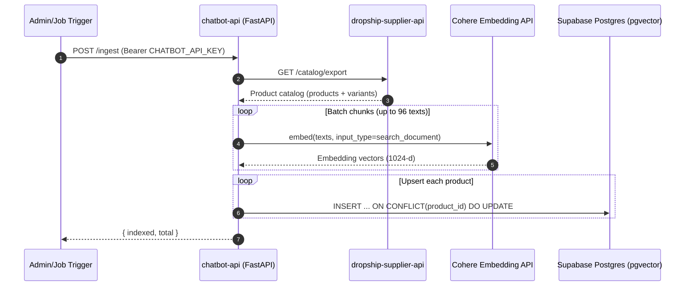
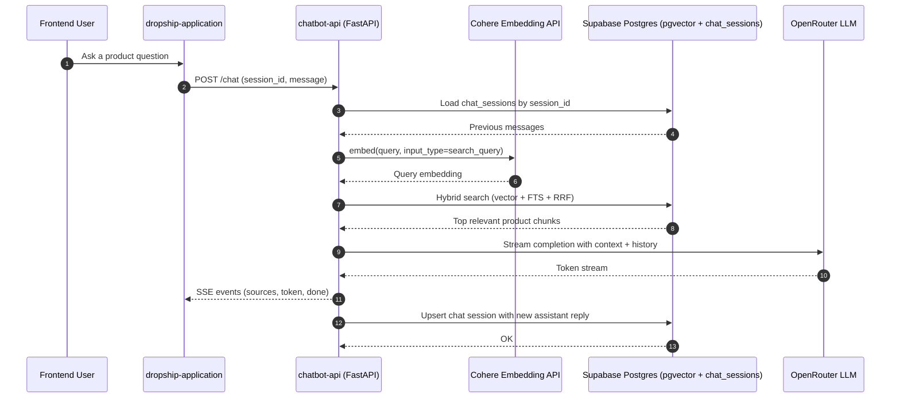
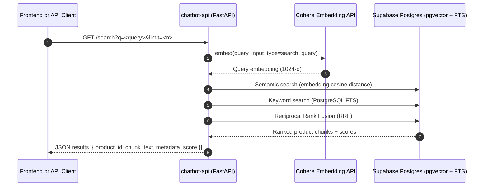
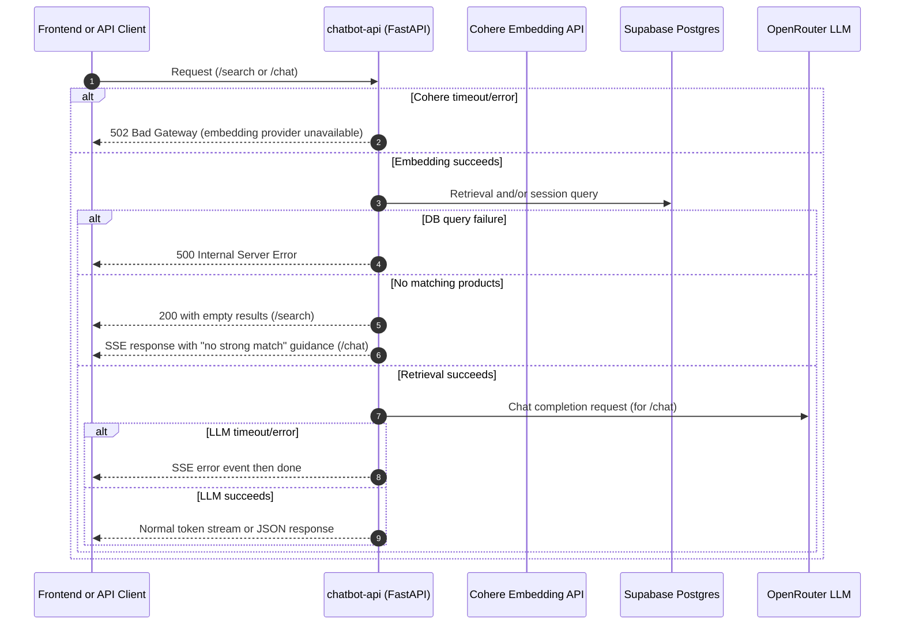

# Chatbot API (Python RAG Backend)

A FastAPI backend that powers product-focused chat and search for the dropship platform.

It keeps the existing supplier API unchanged, ingests product catalog data, stores vector embeddings in Supabase (pgvector), and serves:

- `POST /ingest` for indexing products
- `GET /search` for hybrid retrieval
- `POST /chat` for streaming RAG responses (SSE)

## Project Architecture

### High-Level Components

- **FastAPI application**
  - API routers for ingest, search, and chat
  - Startup lifecycle initializes async database pool
- **Supplier API integration**
  - Reads products from supplier API `GET /catalog/export`
- **Embedding service (Cohere)**
  - Uses `embed-multilingual-v3.0`
  - `search_document` for indexing, `search_query` for retrieval
- **Supabase PostgreSQL + pgvector**
  - Stores product chunks and embeddings
  - Stores chat session history
- **OpenRouter LLM service**
  - Streams chat completions for final user responses
- **Hybrid retriever**
  - Combines vector similarity and PostgreSQL full-text search with RRF scoring

### Data Stores

- `public.product_embeddings`
  - `product_id`, `chunk_text`, `embedding vector(1024)`, `metadata`, timestamps
- `public.chat_sessions`
  - `session_id`, `messages jsonb`, timestamps

## Main Workflows (Mermaid Sequence Charts)

### 1) Product Ingestion Workflow



### 2) Chat RAG Workflow



### 3) Search-Only Workflow (`GET /search`)



### 4) Failure Paths (Operational)



## Repository Structure

```text
chatbot-api/
├── app/
│   ├── main.py
│   ├── config.py
│   ├── database.py
│   ├── models/
│   │   └── schemas.py
│   ├── routers/
│   │   ├── ingest.py
│   │   ├── search.py
│   │   └── chat.py
│   ├── services/
│   │   ├── supplier.py
│   │   ├── embeddings.py
│   │   ├── retriever.py
│   │   ├── llm.py
│   │   └── rag.py
│   └── utils/
│       ├── chunking.py
│       └── prompts.py
├── .vscode/mcp.json
├── .env.example
├── requirements.txt
├── Procfile
└── runtime.txt
```

## Configuration

Set environment values in `.env`:

- `DATABASE_URL`
- `SUPABASE_URL`
- `SUPABASE_SERVICE_ROLE_KEY`
- `SUPPLIER_API_BASE_URL`
- `COHERE_API_KEY`
- `OPENROUTER_API_KEY`
- `CHATBOT_API_KEY`
- `OPENROUTER_MODEL` (optional, default `openai/gpt-4o-mini`)
- `ALLOWED_ORIGINS` (optional, default `*`)

## Run Locally

1. Install dependencies:

```bash
python -m pip install -r requirements.txt
```

2. Start API:

```bash
uvicorn app.main:app --reload
```

3. Health check:

```bash
curl http://localhost:8000/health
```

## API Endpoints

- `GET /health`
  - Service health check
- `POST /ingest`
  - Pulls supplier catalog and writes embeddings into `product_embeddings`
  - Requires `Authorization: Bearer <CHATBOT_API_KEY>` when key is configured
- `GET /search?q=...&limit=5`
  - Hybrid product retrieval
- `POST /chat`
  - SSE streaming RAG response
  - Body: `{ "session_id": "...", "message": "...", "locale": "en" }`

## Notes

- Supplier API remains independent and is not modified by this project.
- Current implementation is designed for the existing Supabase project and can be migrated later by changing environment values and re-running ingestion.
